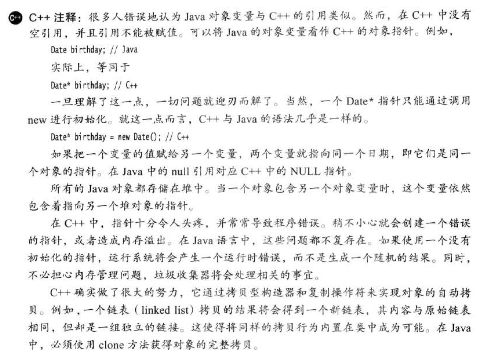

# 第四章  对象与类
## 4.1 面向对象程序设计概述
### 4.1.1 类
名词：class（类）、construct（构造）、instance（实例）、
 
encapsulation（封装）：对象中的数据称为实例域（instance filed）

method（方法）：操纵数据的过程
### 4.1.2 对象
对象的三个特性
* behavior ——   可以对对象施加哪些操作，或者可以对对象施加哪些方法
* state ——  当施加方法时，对象如何响应
* identity ——   如何辨别具有相同行为与模式的不同对象
### 4.1.3 识别类
### 4.1.4 类之间的关系
* dependence（依赖）：use -a 一个类操纵另一个类的对象
* aggregation（聚合）：has -a 类A的对象包含类B的对象
* inheritance （继承）：is -a 类A拓展类B。类A不但包含继承自类B的方法，还会有额外功能

UML（Unified Modeling Language）统一建模语言

## 4.2 使用预定义类
### 4.2.1 对象与对象变量
constructor（构造器）：构造并初始化对象
``` java
     Data deadline；    //对象变量 deadline doesn't refer to any object
     deadline = new Data();   //对象 (1) use constrator to initialize an instance
     Data birthday = new Data(); 
     deadline = brithday;   //(2) use an exist instance
```
一定要意识到：一个对象变量并没有实际包含一个对象../img/CppQuoteTip.jpeg，而仅仅只是引用

局部变量不会自动的初始化为null，而必须通过调用new或将它们设定为null进行初始化

 

### 4.2.2 Gregorian Calendar 
[GregorianCalendarTest.java](./com/yyin/oop_class/GregorianCalendarTest.java)
### 4.更改器方法和访问器方法
mutator method(get) : 对实例域作出修改的方法称为更改器方法

accessor method(set) : 仅访问实例域而不进行修改的方法称为访问器方法

[CalendarApplication.java](./com/yyin/oop_class/CalendarApplication.java)